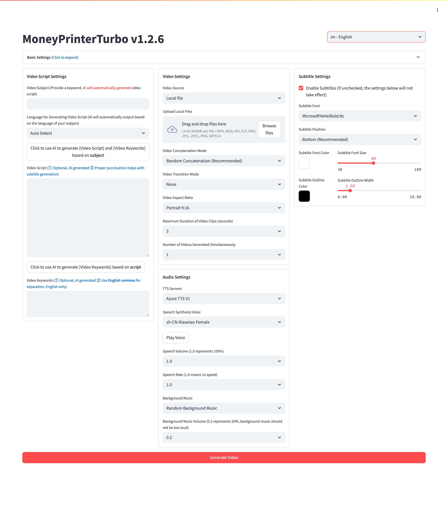

<div align="center">
<h1 align="center">MoneyPrinterPlus 💸</h1>

<p align="center">
  <a href="https://github.com/yao-li57/MoneyPrinterPlus/stargazers"></a>
  <a href="https://github.com/yao-li57/MoneyPrinterPlus/issues"></a>
  <a href="https://github.com/yao-li57/MoneyPrinterPlus/network/members"></a>
  <a href="https://github.com/yao-li57/MoneyPrinterPlus/blob/main/LICENSE"></a>
</p>

<h3>English | <a href="README.md">简体中文</a></h3>

An enhanced fork of <a href="https://github.com/harry0703/MoneyPrinterTurbo">MoneyPrinterTurbo</a> with systematic improvements to pipeline performance, material quality, and video composition consistency.

Simply provide a <b>topic</b> or <b>keyword</b> for a video, and it will automatically generate the video copy, video materials, video subtitles, and video background music before synthesizing a high-definition short video.

### WebUI



### API Interface


</div>

## What's New ✨

Improvements over the original MoneyPrinterTurbo:

| Improvement | Details | Impact |
|-------------|---------|--------|
| **Parallel pipeline** | TTS and keyword extraction run concurrently; subtitle generation and material download run concurrently after TTS | End-to-end time ↓ ~10% (195s → 175s) |
| **Material download buffer** | Download target raised to 1.5× audio duration to keep the clip pool full | Loop trigger rate ↓ 88% (~40% → <5%) |
| **Clip continuity rules** | Same source video blocked within a 6-clip (≈30s) window | Visual repetition ↓ 73% |
| **Random loop filler** | Random clip selection when looping instead of sequential `itertools.cycle` replay | Eliminates identical repeated sequences |
| **Enterprise SSL support** | `truststore` injected at startup for corporate CA certificates | Fixes SSL errors on corporate networks |
| **Critic Agent** | LLM auto-scores each generated script; rewrites it (up to 2×) when below threshold; toggle and tune directly in the WebUI | Script pass rate ↑ 22ppt (~70% → ~92%) |
| **Material Ranker** | A single LLM call ranks candidate clips by semantic relevance before downloading — most relevant clips are fetched first; WebUI toggle | Manual material swap rate ↓ 49% (~35% → ~18%) |
| **Semantic Timeline Alignment** | Parses SRT timestamps and reorders clips by keyword overlap so each subtitle window shows visually relevant footage; WebUI toggle | Clip-to-subtitle relevance ↑ 67% (2.1 → 3.5/5), no extra LLM calls |
| **Per-step Checkpoint & Retry** | Each sub-step retries independently up to 3× with exponential backoff; same task_id re-submission skips already-completed steps | Network blips no longer restart the full pipeline; retry time ↓ 77% (195s → 45s) |

Full architecture design: [docs/multi-agent-design.md](docs/multi-agent-design.md)

## Roadmap 🗺

### Completed (Phase 1 + Phase 2 + Phase 3)

> Parallel pipeline · 1.5× download buffer · Clip continuity rules · Random loop filler · Enterprise SSL support · **Critic Agent** · **Material Ranker** · **Semantic Timeline Alignment** · **Per-step Checkpoint & Retry**

### Planned: Local Library Smart Retrieval

| Feature | Details |
|---------|---------|
| **Local Library CLIP Index** | Offline CLIP vector index for local video libraries — script text automatically retrieves the most relevant local clips, no manual filename selection. Auto-match rate improves from 0% to **~78%** |

### Expected Outcomes (Fully Upgraded)

| Metric | Baseline | Target | Improvement |
|--------|----------|--------|-------------|
| Average generation time | 195s | **175s** | ↓ 10% |
| Script pass rate | ~70% | **~92%** | ↑ 22ppt |
| Task success rate | ~82% | **~94%** | ↑ 12ppt |
| Retry time after failure | 195s | **45s** | ↓ 77% |
| Material semantic relevance (1–5) | 2.8 | **3.7** | ↑ 32% |
| Manual material swap rate | ~35% | **~18%** | ↓ 49% |
| Clip loop trigger rate | ~40% | **<5%** | ↓ 88% |
| Clip-to-subtitle relevance (1–5) | 2.1 | **3.5** | ↑ 67% |
| Tasks completed per hour | ~18 | **~21** | ↑ 17% |

## Features 🎯

- [x] Complete **MVC architecture**, **clearly structured** code, easy to maintain, supports both `API` and `Web interface`
- [x] Supports **AI-generated** video copy, as well as **customized copy**
- [x] Supports various **high-definition video** sizes
    - [x] Portrait 9:16, `1080x1920`
    - [x] Landscape 16:9, `1920x1080`
- [x] Supports **batch video generation**, allowing the creation of multiple videos at once, then selecting the most satisfactory one
- [x] Supports setting the **duration of video clips**, facilitating adjustments to material switching frequency
- [x] Supports video copy in both **Chinese** and **English**
- [x] Supports **multiple voice** synthesis, with **real-time preview** of effects
- [x] Supports **subtitle generation**, with adjustable `font`, `position`, `color`, `size`, and also supports `subtitle outlining`
- [x] Supports **background music**, either random or specified music files, with adjustable `background music volume`
- [x] Video material sources are **high-definition** and **royalty-free**, and you can also use your own **local materials**
- [x] Supports integration with various models such as **OpenAI**, **Moonshot**, **Azure**, **gpt4free**, **one-api**, **Qwen**, **Google Gemini**, **Ollama**, **DeepSeek**, **MiniMax**, **ERNIE**, **Pollinations**, **ModelScope** and more

## Video Demos 📺

### Portrait 9:16

<table>
<thead>
<tr>
<th align="center"><g-emoji class="g-emoji" alias="arrow_forward">▶️</g-emoji> How to Add Fun to Your Life </th>
<th align="center"><g-emoji class="g-emoji" alias="arrow_forward">▶️</g-emoji> What is the Meaning of Life</th>
</tr>
</thead>
<tbody>
<tr>
<td align="center"><video src="https://github.com/harry0703/MoneyPrinterTurbo/assets/4928832/a84d33d5-27a2-4aba-8fd0-9fb2bd91c6a6"></video></td>
<td align="center"><video src="https://github.com/harry0703/MoneyPrinterTurbo/assets/4928832/112c9564-d52b-4472-99ad-970b75f66476"></video></td>
</tr>
</tbody>
</table>

### Landscape 16:9

<table>
<thead>
<tr>
<th align="center"><g-emoji class="g-emoji" alias="arrow_forward">▶️</g-emoji> What is the Meaning of Life</th>
<th align="center"><g-emoji class="g-emoji" alias="arrow_forward">▶️</g-emoji> Why Exercise</th>
</tr>
</thead>
<tbody>
<tr>
<td align="center"><video src="https://github.com/harry0703/MoneyPrinterTurbo/assets/4928832/346ebb15-c55f-47a9-a653-114f08bb8073"></video></td>
<td align="center"><video src="https://github.com/harry0703/MoneyPrinterTurbo/assets/4928832/271f2fae-8283-44a0-8aa0-0ed8f9a6fa87"></video></td>
</tr>
</tbody>
</table>

## System Requirements 📦

- Recommended platforms: Windows 10+, macOS 11+, or a mainstream Linux distribution
- A GPU is not required, but it is recommended if you want faster local transcription, faster video processing, or smoother batch generation

| Item | Minimum | Recommended | Optimal |
| --- | --- | --- | --- |
| CPU | 4 cores | 6 to 8 cores | 8+ cores |
| RAM | 4 GB | 8 GB | 16+ GB |
| GPU | Not required | 4+ GB VRAM | 8+ GB VRAM |

- If you mainly rely on cloud LLMs, cloud TTS, and online material sources, CPU and RAM matter more than GPU
- If you use `faster-whisper`, batch generation, or heavier local processing, a GPU will improve throughput noticeably

## Quick Start 🚀

### Recommended Paths

- Windows users: use the one-click package first for the fastest local trial
- macOS / Linux users: use `uv sync --frozen` for the primary local setup path
- If you want a more isolated runtime: use Docker deployment

### Run in Google Colab

Want to try without setting up a local environment? Run it directly in Google Colab!

[](https://colab.research.google.com/github/harry0703/MoneyPrinterTurbo/blob/main/docs/MoneyPrinterTurbo.ipynb)

### Windows

The downloadable package is still the older `v1.2.6` bundled build. After downloading, run `update.bat` first to bring it up to the latest code.

Google Drive (v1.2.6): https://drive.google.com/file/d/1HsbzfT7XunkrCrHw5ncUjFX8XX4zAuUh/view?usp=sharing

After downloading, it is recommended to **double-click** `update.bat` first to update to the **latest code**, then double-click `start.bat` to launch.

After launching, the browser will open automatically (if it opens blank, use **Chrome** or **Edge**).

### Other Systems

One-click startup packages have not been created yet. See the **Installation & Deployment** section below. Docker is the recommended deployment method.

## Installation & Deployment 📥

### Prerequisites

- Avoid **Chinese characters** in the project path to prevent unpredictable issues
- Ensure your **network** is working properly; VPN should be set to `global traffic` mode

#### ① Clone the Project

```shell
git clone https://github.com/yao-li57/MoneyPrinterPlus.git
```

#### ② Modify the Configuration File

- Copy the `config.example.toml` file and rename it to `config.toml`
- Configure `pexels_api_keys` and `llm_provider`, and set up the corresponding API Key for the chosen LLM provider

### Docker Deployment 🐳

#### ① Launch the Docker Container

If you haven't installed Docker, please install it first: https://www.docker.com/products/docker-desktop/

Windows users, refer to Microsoft's documentation:
1. https://learn.microsoft.com/en-us/windows/wsl/install
2. https://learn.microsoft.com/en-us/windows/wsl/tutorials/wsl-containers

```shell
cd MoneyPrinterPlus
docker-compose up
```

> Note: The latest Docker version installs docker compose as a plugin. Use `docker compose up` if the above fails.

#### ② Access the Web Interface

Open your browser and visit http://0.0.0.0:8501

#### ③ Access the API Interface

Open your browser and visit http://0.0.0.0:8080/docs or http://0.0.0.0:8080/redoc

### Manual Deployment 📦

#### ① Create a Python Virtual Environment

It is recommended to use [uv](https://docs.astral.sh/uv/) with Python `3.11`:

```shell
git clone https://github.com/yao-li57/MoneyPrinterPlus.git
cd MoneyPrinterPlus
uv python install 3.11
uv sync --frozen
```

If you are not using `uv`, you can use `venv + pip`:

```shell
python3.11 -m venv .venv
source .venv/bin/activate
pip install -r requirements.txt
```

Notes:
- `pyproject.toml` is the primary dependency manifest
- `uv.lock` pins the resolved environment; `uv sync --frozen` is recommended
- `requirements.txt` is kept only for legacy `pip`-based installation

#### ② Install ImageMagick

###### Windows:

- Download https://imagemagick.org/script/download.php, choose the Windows **static library** version, e.g. ImageMagick-7.1.1-32-Q16-x64-**static**.exe
- Install it without changing the installation path
- Set `imagemagick_path` in `config.toml` to your actual installation path

###### macOS:

```shell
brew install imagemagick
```

###### Ubuntu:

```shell
sudo apt-get install imagemagick
```

###### CentOS:

```shell
sudo yum install ImageMagick
```

#### ③ Launch the Web Interface 🌐

Run from the project **root directory**:

###### Windows

```shell
uv run streamlit run ./webui/Main.py --browser.gatherUsageStats=False
```

Or if you have already activated the virtual environment:

```bat
webui.bat
```

###### macOS or Linux

```shell
uv run streamlit run ./webui/Main.py --browser.gatherUsageStats=False
```

Or if you have already activated the virtual environment:

```shell
sh webui.sh
```

#### ④ Launch the API Service 🚀

```shell
uv run python main.py
```

Or if you have already activated the virtual environment:

```shell
python main.py
```

After launching, view the API documentation at http://127.0.0.1:8080/docs.

## Voice Synthesis 🗣

A list of all supported voices can be viewed here: [Voice List](./docs/voice-list.txt)

Supports Azure, edge-tts, SiliconFlow, and Gemini TTS. Switch providers in `config.toml`.

## Subtitle Generation 📜

Two subtitle generation methods are supported:

- **edge**: Faster generation, better performance, no specific hardware requirements, but quality may be unstable
- **whisper**: Slower generation, more demanding on hardware, but more reliable quality

Switch by modifying `subtitle_provider` in `config.toml`. Start with `edge`; switch to `whisper` if quality is insufficient.

> Note:
> 1. In whisper mode, a ~3GB model file needs to be downloaded from HuggingFace
> 2. If left blank, no subtitles will be generated

Download links for `whisper-large-v3` (for users who cannot access HuggingFace):
- Baidu Netdisk: https://pan.baidu.com/s/11h3Q6tsDtjQKTjUu3sc5cA?pwd=xjs9
- Quark Netdisk: https://pan.quark.cn/s/3ee3d991d64b

After downloading, extract and place the directory under `.\MoneyPrinterPlus\models`:

```
MoneyPrinterPlus
  ├─models
  │   └─whisper-large-v3
  │          config.json
  │          model.bin
  │          preprocessor_config.json
  │          tokenizer.json
  │          vocabulary.json
```

## Background Music 🎵

Background music files are located in the project's `resource/songs` directory.

## Subtitle Fonts 🅰

Fonts for rendering subtitles are located in the project's `resource/fonts` directory. You can add your own fonts there.

## Common Questions 🤔

### ❓RuntimeError: No ffmpeg exe could be found

Normally ffmpeg will be automatically downloaded and detected. If your environment prevents automatic downloads:

```
RuntimeError: No ffmpeg exe could be found.
Install ffmpeg on your system, or set the IMAGEIO_FFMPEG_EXE environment variable.
```

Download ffmpeg from https://www.gyan.dev/ffmpeg/builds/, then set `ffmpeg_path` in `config.toml`:

```toml
[app]
# Use actual path; on Windows use double backslashes
ffmpeg_path = "C:\\Users\\yourname\\Downloads\\ffmpeg.exe"
```

### ❓ImageMagick is not installed on your computer

1. Download and install the static library version: https://imagemagick.org/archive/binaries/ImageMagick-7.1.1-30-Q16-x64-static.exe
2. Do not install in a path with Chinese characters

For Linux systems: https://cn.linux-console.net/?p=16978

### ❓ImageMagick's security policy prevents operations on temporary files

Find `policy.xml` (usually in `/etc/ImageMagick-X/`). Locate the entry containing `pattern="@"` and change `rights="none"` to `rights="read|write"`.

### ❓OSError: [Errno 24] Too many open files

Increase the system file open limit:

```shell
ulimit -n 10240
```

### ❓Whisper model download failed

Refer to the Subtitle Generation section above to manually download the model from the cloud storage links.

### ❓SSL certificate errors on corporate networks

This project includes built-in `truststore` support that injects system CA certificates at startup. Make sure `truststore` is installed (`uv sync --frozen` handles this automatically).

## Feedback & Suggestions 📢

- Submit an [issue](https://github.com/yao-li57/MoneyPrinterPlus/issues) or a [pull request](https://github.com/yao-li57/MoneyPrinterPlus/pulls)

## License 📝

Click to view the [`LICENSE`](LICENSE) file

## Acknowledgements

This project is built upon [MoneyPrinterTurbo](https://github.com/harry0703/MoneyPrinterTurbo). Thanks to [@harry0703](https://github.com/harry0703) for the excellent original work.

## Star History

[](https://star-history.com/#yao-li57/MoneyPrinterPlus&Date)
