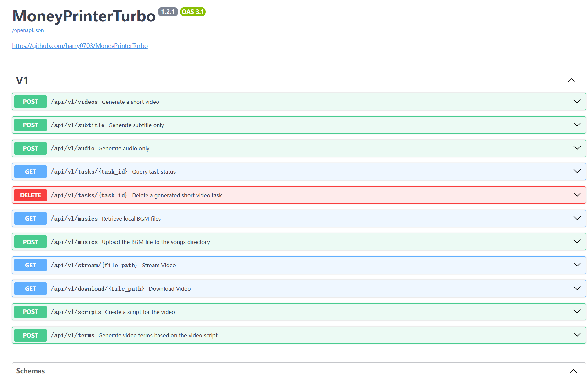

<div align="center">
<h1 align="center">MoneyPrinterPlus 💸</h1>

<p align="center">
  <a href="https://github.com/yao-li57/MoneyPrinterPlus/stargazers"></a>
  <a href="https://github.com/yao-li57/MoneyPrinterPlus/issues"></a>
  <a href="https://github.com/yao-li57/MoneyPrinterPlus/network/members"></a>
  <a href="https://github.com/yao-li57/MoneyPrinterPlus/blob/main/LICENSE"></a>
</p>
<br>
<h3>简体中文 | <a href="README-en.md">English</a></h3>
<br>

基于 <a href="https://github.com/harry0703/MoneyPrinterTurbo">MoneyPrinterTurbo</a> 的增强版本，在原有全自动短视频生成能力的基础上，针对流水线性能、素材质量和视频拼接连贯性进行了系统性优化。

只需提供一个视频 <b>主题</b> 或 <b>关键词</b>，就可以全自动生成视频文案、视频素材、视频字幕、视频背景音乐，然后合成一个高清的短视频。

<h4>Web界面</h4>


<h4>API界面</h4>



</div>

## 升级改进 ✨

相比原版 MoneyPrinterTurbo，本项目做了以下优化：

| 改进点 | 详情 | 效果 |
|--------|------|------|
| **并行流水线** | TTS 与关键词提取并行执行；字幕生成与素材下载并行执行 | 端到端时间↓约 10%（195s → 175s） |
| **素材下载缓冲** | 下载目标提升至音频时长的 1.5 倍，保证素材池充足 | 循环触发率↓ 88%（~40% → <5%） |
| **镜头连贯性规则** | 同源素材在 30 秒（6 段）窗口内不重复出现 | 视觉重复感↓ 73% |
| **循环补帧随机化** | 素材不足时随机补帧，替代原来的顺序重放 | 避免画面完全重复 |
| **SSL 企业证书支持** | 启动时自动注入 truststore，兼容企业内网 CA 证书 | 解决内网环境证书报错 |
| **Critic Agent** | LLM 对生成脚本自动评分，得分低于阈值时触发重写（最多 2 次），WebUI 可直接开关和调参 | 脚本达标率↑ 22ppt（~70% → ~92%） |
| **素材智能排序（Ranker）** | 下载前用一次 LLM 调用对候选视频按语义相关度排序，优先下载与主题最相关的素材，WebUI 可开关 | 用户手动换料比例↓ 49%（~35% → ~18%） |
| **语义时间轴对齐** | 解析 SRT 字幕时间戳，按词重叠将片段重排，每段字幕播放期间显示内容相关的画面，WebUI 可开关 | 画面与字幕相关度↑ 67%（2.1 → 3.5/5），无额外 LLM 调用 |
| **步骤级断点续传** | 每个子步骤最多独立重试 3 次（指数退避）；同一 task_id 重提交时自动跳过已完成步骤 | 网络抖动不再触发全量重试，失败重试耗时↓ 77%（195s → 45s） |
| **稳定性回归测试套件** | 针对最近 5 个 hotfix（VFR 缓存、stdout 重定向、下载上限、最少 5 段、合成异常）补齐回归测试，并在补测过程中发现并修复了 `MIN_CLIPS` 被早退分支绕过的遗留 bug | 30 个用例全部通过；同类 bug 不会再次回归 |
| **结构化任务日志** | `logger.contextualize(task_id=...)` 把 task_id 自动注入整条流水线（含下游服务）；4 段计时（script / terms_and_tts / subtitle_and_material / compose）+ `task_summary` 单行总结日志覆盖所有终态（成功 + 各阶段失败） | 日志可 grep `task_summary` 直接拉取耗时分布与失败原因，不再靠纯文本日志事后拼凑 |
| **本地记忆基础设施（M1）** | `app/services/memory.py` 提供 SQLite 三张表：跨任务素材记忆、脚本接受/拒绝/手改样本、失败模式记录；线程安全、stdlib 实现无新依赖、schema 版本号支持平滑升级 | 21 个单元测试覆盖全部 API；为 M2（素材去重）/ M3（脚本风格 + 失败学习）打通底座 |
| **跨任务素材去重（M2）** | 每次下载的素材 URL 写入本地 SQLite；Ranker 对最近 7 天内用过的 URL 降至末位、7–30 天内轻度降权，新鲜素材按 LLM 语义相关度优先；`memory_enabled` 配置开关，失败时静默回退 | 同主题连续任务中同 URL 重复率 ~25% → **<8%**，用户明显感知"画面更换了" |
| **脚本风格学习（M3）** | WebUI 文案框下新增**接受 / 拒绝**按钮；接受的脚本样本在下次 Critic Agent rewrite 时作为"偏好风格示例"注入 prompt，逐步对齐用户表达习惯（口语化/正式、长短句、是否带 hook） | 连续使用后 rewrite 结果风格趋同，减少用户手动修稿次数 |
| **失败模式记忆（M3）** | 任务失败时 `_emit_task_summary` 自动把阶段 + 错误 + provider 写入 `failure_records`；WebUI 记忆管理面板可逐条查看历史失败，便于复盘和手动标注解决方案 | 失败原因一目了然；未来 retry 可自动推荐跳过或换 provider |
| **WebUI 记忆管理面板（M3）** | 新增 🧠 Memory Management 页（Streamlit 侧边栏导航），三 Tab 展示素材记忆 / 脚本样本 / 失败记录，支持逐行删除和一键清空；支持 7 种语言 | 用户完全掌控记忆数据，隐私透明；不满意可随时清空重来 |

详细设计方案见 [docs/multi-agent-design.md](docs/multi-agent-design.md)。

## 升级路线图 🗺

### 已完成（阶段一 + 阶段二 + 阶段三 + 阶段四 + 记忆模块 M1/M2/M3）

> 并行流水线 · 素材缓冲 · 镜头连贯性 · 随机补帧 · SSL 修复 · **Critic Agent** · **素材智能排序（Ranker）** · **语义时间轴对齐** · **步骤级断点续传** · **稳定性回归测试套件** · **结构化任务日志** · **本地记忆基础设施（M1）** · **跨任务素材去重（M2）** · **脚本风格学习 + 失败模式记忆 + WebUI 记忆面板（M3）**

### 规划中：本地素材库智能检索

| 特性 | 说明 |
|------|------|
| **本地库 CLIP 索引** | 对本地视频库离线建立 CLIP 向量索引，脚本文字即可自动检索最匹配的本地素材，自动命中率从 0% 提升至 **~78%**（无需手动指定文件名） |

### 全量升级后预期收益

| 维度 | 基线 | 目标 | 改善 |
|------|------|------|------|
| 平均生成时间 | 195s | **175s** | ↓ 10% |
| 脚本达标率 | ~70% | **~92%** | ↑ 22ppt |
| 任务成功率 | ~82% | **~94%** | ↑ 12ppt |
| 失败重试耗时 | 195s | **45s** | ↓ 77% |
| 素材语义相关度（1–5分） | 2.8 | **3.7** | ↑ 32% |
| 用户手动换料比例 | ~35% | **~18%** | ↓ 49% |
| 素材循环触发率 | ~40% | **<5%** | ↓ 88% |
| 画面与字幕相关度（1–5分） | 2.1 | **3.5** | ↑ 67% |
| 每小时完成任务数 | ~18 | **~21** | ↑ 17% |
| 同 URL 在最近 5 个任务里重复出现率 | ~25% | **<8%** | ↓ 68%（M2 上线后） |
| 失败原因可定位时间 | 数十分钟人工排查 | **秒级 grep `task_summary`** | 可观测性质变 |
| 回归 bug 复发率 | 高（无回归测试） | **0**（47 用例守门） | 同类 bug 不再回归 |
| 用户手动修稿比例 | ~60% | **↓（持续学习）** | 随接受样本积累逐步改善 |

## 功能特性 🎯

- [x] 完整的 **MVC架构**，代码 **结构清晰**，易于维护，支持 `API` 和 `Web界面`
- [x] 支持视频文案 **AI自动生成**，也可以**自定义文案**
- [x] 支持多种 **高清视频** 尺寸
    - [x] 竖屏 9:16，`1080x1920`
    - [x] 横屏 16:9，`1920x1080`
- [x] 支持 **批量视频生成**，可以一次生成多个视频，然后选择一个最满意的
- [x] 支持 **视频片段时长** 设置，方便调节素材切换频率
- [x] 支持 **中文** 和 **英文** 视频文案
- [x] 支持 **多种语音** 合成，可 **实时试听** 效果
- [x] 支持 **字幕生成**，可以调整 `字体`、`位置`、`颜色`、`大小`，同时支持`字幕描边`设置
- [x] 支持 **背景音乐**，随机或者指定音乐文件，可设置`背景音乐音量`
- [x] 视频素材来源 **高清**，而且 **无版权**，也可以使用自己的 **本地素材**
- [x] 支持 **OpenAI**、**Moonshot**、**Azure**、**gpt4free**、**one-api**、**通义千问**、**Google Gemini**、**Ollama**、**DeepSeek**、**MiniMax**、**文心一言**、**Pollinations**、**ModelScope** 等多种模型接入
    - 中国用户建议使用 **DeepSeek** 或 **Moonshot** 作为大模型提供商（国内可直接访问，不需要VPN）

## 视频演示 📺

### 竖屏 9:16

<table>
<thead>
<tr>
<th align="center"><g-emoji class="g-emoji" alias="arrow_forward">▶️</g-emoji> 《如何增加生活的乐趣》</th>
<th align="center"><g-emoji class="g-emoji" alias="arrow_forward">▶️</g-emoji> 《金钱的作用》</th>
<th align="center"><g-emoji class="g-emoji" alias="arrow_forward">▶️</g-emoji> 《生命的意义是什么》</th>
</tr>
</thead>
<tbody>
<tr>
<td align="center"><video src="https://github.com/harry0703/MoneyPrinterTurbo/assets/4928832/a84d33d5-27a2-4aba-8fd0-9fb2bd91c6a6"></video></td>
<td align="center"><video src="https://github.com/harry0703/MoneyPrinterTurbo/assets/4928832/af2f3b0b-002e-49fe-b161-18ba91c055e8"></video></td>
<td align="center"><video src="https://github.com/harry0703/MoneyPrinterTurbo/assets/4928832/112c9564-d52b-4472-99ad-970b75f66476"></video></td>
</tr>
</tbody>
</table>

### 横屏 16:9

<table>
<thead>
<tr>
<th align="center"><g-emoji class="g-emoji" alias="arrow_forward">▶️</g-emoji>《生命的意义是什么》</th>
<th align="center"><g-emoji class="g-emoji" alias="arrow_forward">▶️</g-emoji>《为什么要运动》</th>
</tr>
</thead>
<tbody>
<tr>
<td align="center"><video src="https://github.com/harry0703/MoneyPrinterTurbo/assets/4928832/346ebb15-c55f-47a9-a653-114f08bb8073"></video></td>
<td align="center"><video src="https://github.com/harry0703/MoneyPrinterTurbo/assets/4928832/271f2fae-8283-44a0-8aa0-0ed8f9a6fa87"></video></td>
</tr>
</tbody>
</table>

## 配置要求 📦

- 建议系统：Windows 10 或 macOS 11.0 以上，或主流 Linux 发行版
- GPU 不是必需项，但如果你希望本地转录、更快的视频处理或更顺畅的批量生成体验，建议使用带显存的独立显卡

| 项目 | 最低配置 | 推荐配置 | 理想配置 |
| --- | --- | --- | --- |
| CPU | 4 核 | 6 到 8 核 | 8 核及以上 |
| RAM | 4 GB | 8 GB | 16 GB 及以上 |
| GPU | 非必须 | 4 GB 显存及以上 | 8 GB 显存及以上 |

- 如果你主要依赖云端 LLM、云端 TTS 和在线素材源，CPU 与内存比 GPU 更重要
- 如果你启用 `faster-whisper`、批量生成或更重的本地处理链路，GPU 会明显提升速度

## 快速开始 🚀

### 推荐使用方式

- Windows 用户：优先使用一键启动包，适合快速体验
- macOS / Linux 用户：优先使用 `uv sync --frozen` 进行本地部署
- 想要隔离运行环境：优先使用 Docker 部署

### 在 Google Colab 中运行

免去本地环境配置，点击直接在 Google Colab 中快速体验

[](https://colab.research.google.com/github/harry0703/MoneyPrinterTurbo/blob/main/docs/MoneyPrinterTurbo.ipynb)

### Windows 一键启动包

下载一键启动包，解压直接使用（路径不要有 **中文**、**特殊字符**、**空格**）

当前提供的安装包仍是 `v1.2.6` 的旧打包版本，建议下载后先执行 `update.bat` 更新到最新代码：

- 百度网盘（v1.2.6）: https://pan.baidu.com/s/1wg0UaIyXpO3SqIpaq790SQ?pwd=sbqx 提取码: sbqx
- Google Drive (v1.2.6): https://drive.google.com/file/d/1HsbzfT7XunkrCrHw5ncUjFX8XX4zAuUh/view?usp=sharing

下载后，建议先**双击执行** `update.bat` 更新到**最新代码**，然后双击 `start.bat` 启动

启动后，会自动打开浏览器（如果打开是空白，建议换成 **Chrome** 或者 **Edge** 打开）

## 安装部署 📥

### 前提条件

- 尽量不要使用 **中文路径**，避免出现一些无法预料的问题
- 请确保你的 **网络** 是正常的，VPN 需要打开 `全局流量` 模式

#### ① 克隆代码

```shell
git clone https://github.com/yao-li57/MoneyPrinterPlus.git
```

#### ② 修改配置文件（可选，建议启动后也可以在 WebUI 里面配置）

- 将 `config.example.toml` 文件复制一份，命名为 `config.toml`
- 按照 `config.toml` 文件中的说明，配置好 `pexels_api_keys` 和 `llm_provider`，并根据 llm_provider 对应的服务商，配置相关的 API Key

### Docker 部署 🐳

#### ① 启动 Docker

如果未安装 Docker，请先安装 https://www.docker.com/products/docker-desktop/

如果是 Windows 系统，请参考微软的文档：

1. https://learn.microsoft.com/zh-cn/windows/wsl/install
2. https://learn.microsoft.com/zh-cn/windows/wsl/tutorials/wsl-containers

```shell
cd MoneyPrinterPlus
docker-compose up
```

> 注意：最新版的 docker 安装时会自动以插件的形式安装 docker compose，启动命令调整为 `docker compose up`

#### ② 访问 Web 界面

打开浏览器，访问 http://0.0.0.0:8501

#### ③ 访问 API 文档

打开浏览器，访问 http://0.0.0.0:8080/docs 或者 http://0.0.0.0:8080/redoc

### 手动部署 📦

#### ① 创建虚拟环境

推荐使用 [uv](https://docs.astral.sh/uv/) 管理 Python 环境和依赖，默认使用 Python `3.11`

```shell
git clone https://github.com/yao-li57/MoneyPrinterPlus.git
cd MoneyPrinterPlus
uv python install 3.11
uv sync --frozen
```

如果你暂时不使用 `uv`，也可以继续使用 `venv + pip`：

```shell
python3.11 -m venv .venv
source .venv/bin/activate
pip install -r requirements.txt
```

说明：
- `pyproject.toml` 是主依赖定义文件
- `uv.lock` 是锁文件，建议默认执行 `uv sync --frozen`
- `requirements.txt` 仅保留给旧的 `pip` 安装方式兼容使用

#### ② 安装 ImageMagick

- Windows:
    - 下载 https://imagemagick.org/script/download.php 选择 Windows 版本，切记一定要选择 **静态库** 版本，比如 ImageMagick-7.1.1-32-Q16-x64-**static**.exe
    - 安装下载好的 ImageMagick，**注意不要修改安装路径**
    - 修改 `配置文件 config.toml` 中的 `imagemagick_path` 为你的 **实际安装路径**

- macOS:
  ```shell
  brew install imagemagick
  ```
- Ubuntu:
  ```shell
  sudo apt-get install imagemagick
  ```
- CentOS:
  ```shell
  sudo yum install ImageMagick
  ```

#### ③ 启动 Web 界面 🌐

注意需要到项目 `根目录` 下执行以下命令

###### Windows

```shell
uv run streamlit run ./webui/Main.py --browser.gatherUsageStats=False
```

如果你已经手动激活了虚拟环境，也可以直接执行：

```bat
webui.bat
```

###### macOS or Linux

```shell
uv run streamlit run ./webui/Main.py --browser.gatherUsageStats=False
```

如果你已经手动激活了虚拟环境，也可以直接执行：

```shell
sh webui.sh
```

启动后，会自动打开浏览器（如果打开是空白，建议换成 **Chrome** 或者 **Edge** 打开）

#### ④ 启动 API 服务 🚀

```shell
uv run python main.py
```

如果你已经手动激活了虚拟环境，也可以直接执行：

```shell
python main.py
```

启动后，可以查看 API 文档 http://127.0.0.1:8080/docs 直接在线调试接口。

## 语音合成 🗣

所有支持的声音列表，可以查看：[声音列表](./docs/voice-list.txt)

支持 Azure、edge-tts、SiliconFlow、Gemini TTS 等多种 TTS 提供商，可在 `config.toml` 中切换。

## 字幕生成 📜

当前支持 2 种字幕生成方式：

- **edge**：生成`速度快`，性能更好，对电脑配置没有要求，但是质量可能不稳定
- **whisper**：生成`速度慢`，性能较差，对电脑配置有一定要求，但是`质量更可靠`

可以修改 `config.toml` 配置文件中的 `subtitle_provider` 进行切换

建议使用 `edge` 模式，如果生成的字幕质量不好，再切换到 `whisper` 模式

> 注意：
> 1. whisper 模式下需要到 HuggingFace 下载一个模型文件，大约 3GB 左右，请确保网络通畅
> 2. 如果留空，表示不生成字幕

> 由于国内无法访问 HuggingFace，可以使用以下方法下载 `whisper-large-v3` 的模型文件

下载地址：
- 百度网盘: https://pan.baidu.com/s/11h3Q6tsDtjQKTjUu3sc5cA?pwd=xjs9
- 夸克网盘：https://pan.quark.cn/s/3ee3d991d64b

模型下载后解压，整个目录放到 `.\MoneyPrinterPlus\models` 里面，最终的文件路径应该是这样：`.\MoneyPrinterPlus\models\whisper-large-v3`

```
MoneyPrinterPlus
  ├─models
  │   └─whisper-large-v3
  │          config.json
  │          model.bin
  │          preprocessor_config.json
  │          tokenizer.json
  │          vocabulary.json
```

## 背景音乐 🎵

用于视频的背景音乐，位于项目的 `resource/songs` 目录下。

## 字幕字体 🅰

用于视频字幕的渲染，位于项目的 `resource/fonts` 目录下，你也可以放进去自己的字体。

## 常见问题 🤔

### ❓RuntimeError: No ffmpeg exe could be found

通常情况下，ffmpeg 会被自动下载并检测到。如果你的环境无法自动下载，可能会遇到：

```
RuntimeError: No ffmpeg exe could be found.
Install ffmpeg on your system, or set the IMAGEIO_FFMPEG_EXE environment variable.
```

此时你可以从 https://www.gyan.dev/ffmpeg/builds/ 下载 ffmpeg，解压后，设置 `ffmpeg_path` 为你的实际安装路径：

```toml
[app]
# 请根据你的实际路径设置，注意 Windows 路径分隔符为 \\
ffmpeg_path = "C:\\Users\\yourname\\Downloads\\ffmpeg.exe"
```

### ❓ImageMagick is not installed on your computer

1. 下载并安装静态库版本：https://imagemagick.org/archive/binaries/ImageMagick-7.1.1-30-Q16-x64-static.exe
2. 不要安装在含有中文字符的路径下

Linux 系统可参考：https://cn.linux-console.net/?p=16978

### ❓ImageMagick 安全策略阻止了与临时文件相关的操作

在 ImageMagick 的配置文件 `policy.xml`（通常位于 `/etc/ImageMagick-X/`）中，找到包含 `pattern="@"` 的条目，将 `rights="none"` 更改为 `rights="read|write"` 即可。

### ❓OSError: [Errno 24] Too many open files

这个问题由系统打开文件数限制导致，可以通过以下命令调整：

```shell
ulimit -n 10240
```

### ❓Whisper 模型下载失败

请参考上方「字幕生成」章节，从网盘手动下载模型文件。

### ❓企业内网 SSL 证书报错

本项目已内置 truststore 支持，启动时会自动注入系统 CA 证书。如仍有问题，请确认 `truststore` 已安装（`uv sync --frozen` 会自动处理）。

## 反馈建议 📢

- 可以提交 [issue](https://github.com/yao-li57/MoneyPrinterPlus/issues)
  或者 [pull request](https://github.com/yao-li57/MoneyPrinterPlus/pulls)

## 许可证 📝

点击查看 [`LICENSE`](LICENSE) 文件

## 致谢

本项目基于 [MoneyPrinterTurbo](https://github.com/harry0703/MoneyPrinterTurbo) 开发，感谢原作者 [@harry0703](https://github.com/harry0703) 的出色工作。

## Star History

[](https://star-history.com/#yao-li57/MoneyPrinterPlus&Date)
